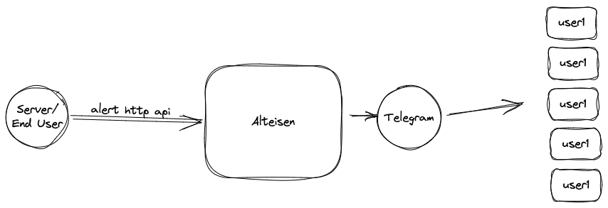

# Alteisen

使用Telegram Bot實作一個告警通知服務，可用於CI/CD或一般程式發生非預定錯誤時，在第一時間透過Telegram進行通知

## Architecture



## Deploy Guide

***step1. setting config/env***

use config yaml

```shell
cp conf/config.example.yaml ./yaml
```

PS 也可以使用環境變數來指定特定參數值 EX:

```shell
export <param_key> <param_value>
```

| 參數 | 型態 | 說明 |
| ---- | --- | --- |
| app.name | string | service name |
| app.version| string | service version |
| **http_serv.addr**| string | http service port  |
| **http_serv.mode** | string | debug/release mode |
| **http_serv.read_timeout** | string | http server 讀取時逾時時效 |
| **http_serv.write_timeout** | string | http server 寫入時逾時時效 |
| **bot.target_chat_id** | int | 預設發送訊息房間名稱 |
| **bot.token** | string | telgoran bot token |
| **bot.base_url** | string | service url，為了產生telgoran bot webhook callback url，需為https |

***step2. Run Service***

```shell
go run cmd/app/main.go
```

## REFERENCE

1. [Bots: An introduction for developers](https://core.telegram.org/bots)
